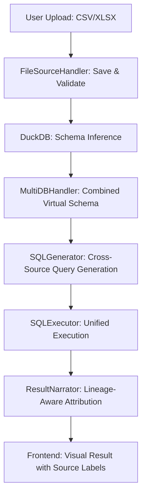

# PR Audit Report: File Data Source Integration (Phase 13)

## 📋 Executive Summary
This audit evaluates the implementation of CSV and Excel file support (Phase 13). The feature is architecturally sound and leverages DuckDB effectively for virtualizing file data. However, one **critical logic bug** regarding cache key collisions was identified, along with minor UX and performance optimizations.

---

## 🛠️ Senior Software Engineer's Audit
**Focus: Code Quality, Logic, Error Handling**

### 🚩 Critical Issue: Cache Key Collision
In [multi_db_query.py](file:///Users/sam/DevelopmentProjects/googleAntiGravityProject/database-guru/src/api/endpoints/multi_db_query.py), the `process_multi_db_query` endpoint computes a cache key hash using `request.question` and `request.connections`, but **excludes `request.file_source_ids`**.
- **Impact**: If a user queries "List all sales" with `file_id=1`, and then another user queries "List all sales" with `file_id=2`, the second user might receive cached results from the first file.
- **Fix**: Incorporate `file_source_ids` into the cache key hash.

### ⚠️ Synchronous Blocking in Async Context
The `excel_to_temp_csv` method in `FileSourceHandler` performs potentially heavy I/O and conversion synchronously. When called during `getFilePreview`, it may block the FastAPI event loop for very large Excel files.
- **Fix**: Wrap the Excel conversion in `anyio.to_thread.run_sync` or use a process pool for heavy conversions.

### ✅ Wins
- **Robust Sanitization**: Filename and path validation are excellent, preventing traversal attacks.
- **DuckDB Virtualization**: The lifecycle management for DuckDB tables (load/unload) is efficient and thread-safe.

---

## 🏗️ Data Architect's Audit
**Focus: Schema, Lineage, State Management**

### 🔗 Data Lineage Flow
The integration successfully traces data from raw uploads to LLM-generated insights.

### 🗄️ State Persistence
The `active_file_source_ids` are correctly persisted in the `ChatSession` model, allowing users back to their workspace without re-uploading or re-associating files.

---

## 📈 Data Analyst's Audit
**Focus: Utility, Telemetry, Bias**

- **Inference Accuracy**: Automatic type detection via DuckDB is high-fidelity, reducing the "LLM hallucination" risk for numeric/date columns.
- **Result Attribution**: The `ResultNarrator` correctly identifies when data comes from a "local file" vs. a "production database," providing crucial truth-source context.
- **Telemetry Missing**: There is currently no tracking for "File Upload Success Rate" or "Conversion Latency," which would be useful for production monitoring.

---

## 📅 Project Manager's Audit
**Focus: Scope, UX, Tech Debt**

- **UI/UX WOW Factor**: The file preview drawer and the multi-source toggle in the chat interface feel premium and intuitive.
- **Simulation Debt**: File upload progress is simulated with a timer. While acceptable for MVP, it may lead to user frustration if a large file takes longer than the "estimated" 90% mark.
- **Future Proofing**: The `FileSource` model includes `file_hash` for future deduplication features, which is a great forward-looking addition.

---

## 🚀 Action Plan: Critical Fixes

### 1. Fix Multi-Source Cache Key (Urgent)
Modify `src/api/endpoints/multi_db_query.py` to include file IDs in the hash calculation.

### 2. Offload Excel Processing (High)
Move `excel_to_temp_csv` calls to a thread pool to preserve API responsiveness.

### 3. Real Progress Tracking (Medium)
Replace simulated upload timers with actual `onUploadProgress` hooks from Axios.

### 4. Table Validation Extension (Low)
Update the lineage agent's table validator to recognize virtual DuckDB table names.
