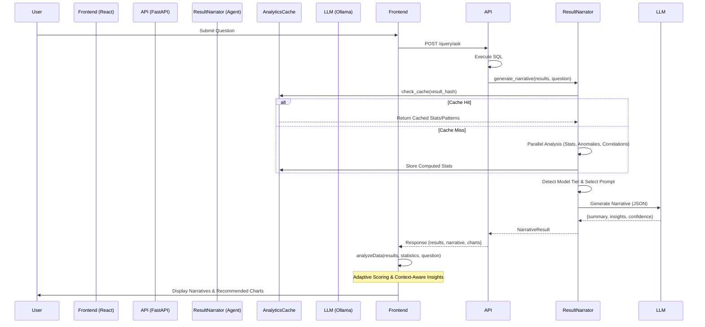

# Data & Agentic Flow: Phase 19 Insights Pipeline

## 1. Request Flow (End-to-End)



## 2. Agentic Analysis Logic (Backend)

The `ResultNarrator` uses a parallel pipeline to minimize latency while maximizing insight depth.

```text
[ Query Results ]
       |
       v
+-----------------------------------------------------------+
| Parallel Analysis Pipeline (asyncio.gather)               |
|                                                           |
|  [Task 1] Extract Statistics (Numeric & String metrics)   |
|  [Task 2] Detect Statistical Anomalies (Z-score method)   |
|  [Task 3] Calculate Correlations (Pearson coefficient)    |
|                                                           |
+-----------------------------------------------------------+
       |
       v
+-----------------------------------------------------------+
| Sequential Context Gathering                              |
|                                                           |
|  [Step 1] Detect Temporal Columns                         |
|  [Step 2] Detect Trends (Linear Regression on Time)       |
|  [Step 3] Multi-DB Quality Report (if cross-database)     |
|                                                           |
+-----------------------------------------------------------+
       |
       v
+-----------------------------------------------------------+
| LLM Prompt Synthesis                                      |
|                                                           |
|  [Small Model] -> Compact Prompt (Essential stats only)   |
|  [Medium Model] -> Standard Narrative Prompt              |
|  [Large Model] -> Enhanced Prompt (Deep analysis + Qual)  |
|                                                           |
+-----------------------------------------------------------+
       |
       v
[ Final Human-Readable Narrative ]
```

## 3. SQL Generation & Correction Flow (Reference)

```text
1. User Input -> NL to SQL Agent
2. SQL Validation -> Result Verification Agent
3. IF Error -> Self-Correcting Agent (Parallel Strategies)
4. IF Success -> SQL Executor -> Results
5. Results -> ResultNarrator (This Phase) -> Insights
```
