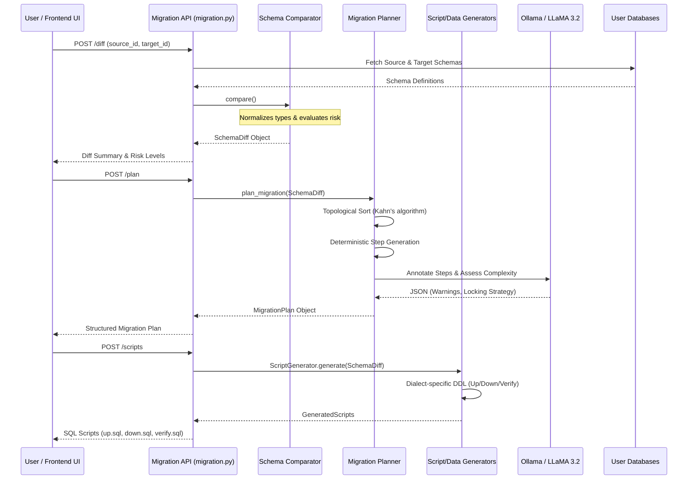

# Phase 20 Visual Flow: Migration Toolkit Architecture

This flow outlines the end-to-end data lineage and request path for generating database migration scripts and plans.

```mermaid
sequenceDiagram
    participant User as User / Frontend UI
    participant API as Migration API (migration.py)
    participant SchemaCmp as Schema Comparator
    participant Planner as Migration Planner
    participant Generator as Script/Data Generators
    participant LLM as Ollama / LLaMA 3.2
    participant DB as User Databases

    User->>API: POST /diff (source_id, target_id)
    API->>DB: Fetch Source & Target Schemas
    DB-->>API: Schema Definitions
    API->>SchemaCmp: compare()
    Note over SchemaCmp: Normalizes types & evaluates risk
    SchemaCmp-->>API: SchemaDiff Object
    API-->>User: Diff Summary & Risk Levels

    User->>API: POST /plan
    API->>Planner: plan_migration(SchemaDiff)
    Planner->>Planner: Topological Sort (Kahn's algorithm)
    Planner->>Planner: Deterministic Step Generation
    Planner->>LLM: Annotate Steps & Assess Complexity
    LLM-->>Planner: JSON (Warnings, Locking Strategy)
    Planner-->>API: MigrationPlan Object
    API-->>User: Structured Migration Plan

    User->>API: POST /scripts
    API->>Generator: ScriptGenerator.generate(SchemaDiff)
    Generator->>Generator: Dialect-specific DDL (Up/Down/Verify)
    Generator-->>API: GeneratedScripts
    API-->>User: SQL Scripts (up.sql, down.sql, verify.sql)
```
